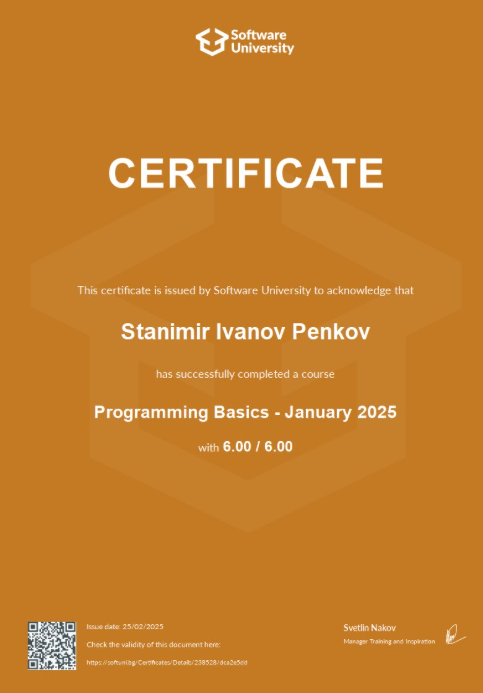

---

#### 💡 За мен:
- 📚 Уча **Приложно програмиране** в **СУ "Йордан Йовков"**
- 📖 В момента уча **C#** и съм изучавал **HTML** и **CSS**
- 💻 Обичам да се занимавам с програмиране, AI и технологии

---

## 🏆 GitHub Трофеи

---

### 📊 Статистики:

---
## Сертификати

| Име на сертификата | Снимка |
| ------------------ |:------:|
| [SoftUni - Programming Basics with C#](https://softuni.bg/certificates/details/238528/dca2e5dd) |  |

---

### 📢 Свържете се с мен:

---

